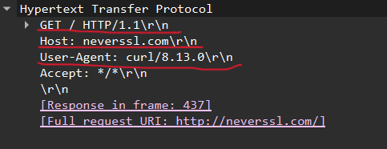
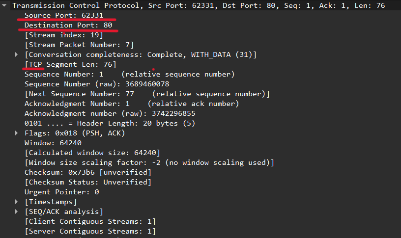
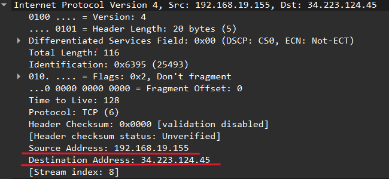
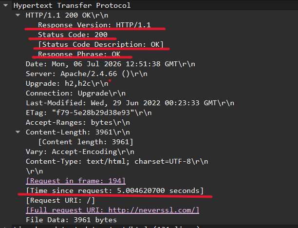
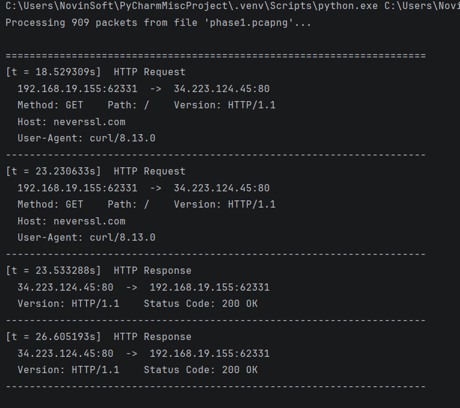

# Project 2 — In-Depth Analysis of the Web Protocol Stack (IP/TCP/HTTP) with curl and Wireshark

Course: Computer Networks
Instructor: Dr. Saadoun Azizi
Faculty of Engineering — Department of Computer Engineering and Information Technology

---

## 1. Responsibility Matrix

| Full Name | Student ID | Phase/Section Completed |
|---|---|---|
| [Soroush Seydimoradi] | [40217023143] | Phase 2 (Header Analysis) + Phase 3 (RTT Analysis) |
| [Zanko khaledian] | [40217023132] | Phase 1 (Setup & Capture) + Phase 4 (Python Script) |

---

## 2. Tools and Execution Environment

- Operating System: [Windows]
- Wireshark Version: [4.6.6]
- curl Version: curl 8.13.0
- Target site used: `http://neverssl.com` 

---

## Phase 1: Environment Setup and Packet Capture (25%)

### 1.1 Method

1. Wireshark was opened and the active network interface (` Wi-Fi `) was selected and capture was started.
2. The following command was executed in the terminal:
   ```
   curl http://neverssl.com
   ```
3. After receiving the full response in the terminal, the Wireshark capture was stopped (Stop).
4. The saved session was stored in `.pcapng` format under the `captures/` directory of this repository.

### 1.2 Output

- Capture file name: `captures/phase1.pcapng`
- Number of packets recorded: 909

---

## Phase 2: Header and Protocol Stack Dissection (30%)

### 2.1 Filter Applied

```
http
```
(equivalent to `tcp.port == 80`)

### 2.2 Identified GET Request Packet

| Layer | Field | Extracted Value |
|---|---|---|
| Layer 7 (Application) | Host | [neverssl.com] |
| Layer 7 (Application) | HTTP Version | [HTTP/1.1] |
| Layer 7 (Application) | User-Agent | [curl/8.13.0\r\n] |
| Layer 4 (Transport) | Source Port | [62331] |
| Layer 4 (Transport) | Destination Port | [80] |
| Layer 4 (Transport) | Transport Layer Protocol | TCP |
| Layer 3 (Network) | Source IP | [192.168.19.155] |
| Layer 3 (Network) | Destination IP | [34.223.124.45] |

**Screenshot: Layer 7 headers (Host, HTTP Version, User-Agent)**
> 

**Screenshot: Layer 4 headers (Source/Destination Port, TCP)**
> 

**Screenshot: Layer 3 headers (Source/Destination IP)**
> 

---

## Phase 3: Server Behavior and RTT Timing Analysis (25%)

### 3.1 Server Response Packet

- Response status line: `HTTP/1.1 200 OK`
- Status code: `200`
- Meaning of the status code: [Successful request and content returned]

### 3.2 Time Delta (RTT)

- Recorded Time Delta value: `5.004620700 seconds`
- Location of this value in Wireshark: the `[Time since request]` field in Hypertext Transfer Protocol.
- Interpretation: this value corresponds to the RTT (Round Trip Time) between sending the request from the client and receiving the first byte of the response from the server.

**Screenshot: Time Delta field and HTTP response packet with status code**
> 

### 3.3 Slowness Scenario (Engineering Analysis)

> In this session, the Time Delta between sending the GET request and receiving the server's response was `[5.004620700 seconds]` seconds.
> If, this value exceeded 2 seconds, there would be three likely sources of the delay:
> (1) network latency between the client and server, caused by a long routing path or bandwidth congestion;
> (2) heavy processing on the server side, such as a database query or high processing load;
> (3) resource constraints on the client side.
> Considering that the TCP handshake (SYN/SYN-ACK) in this session was completed quickly, it can be concluded that the delay was mainly due to request processing time on the server side, rather than a network issue.

---

## Phase 4 (Optional): Python pcap Processing Script — Option A

### 4.1 Description

The `scripts/parse_http_pcap.py` script takes the pcap/pcapng file from Phase 1 as input, uses the `scapy` library to identify TCP packets carrying HTTP traffic, and for each HTTP request and response, prints the IP addresses, ports, request method/path, Host header, User-Agent, and response status code to the terminal.

### 4.2 How to Run

```bash
pip install scapy
python3 scripts/parse_http_pcap.py captures/phase1.pcapng
```

### 4.3 Sample Real Output

```
[t = 18.529309s]  HTTP Request
  192.168.19.155:62331  ->  34.223.124.45:80
  Method: GET    Path: /    Version: HTTP/1.1
  Host: neverssl.com
  User-Agent: curl/8.13.0
----------------------------------------------------------------------
[t = 23.230633s]  HTTP Request
  192.168.19.155:62331  ->  34.223.124.45:80
  Method: GET    Path: /    Version: HTTP/1.1
  Host: neverssl.com
  User-Agent: curl/8.13.0
----------------------------------------------------------------------
[t = 23.533288s]  HTTP Response
  34.223.124.45:80  ->  192.168.19.155:62331
  Version: HTTP/1.1    Status Code: 200 OK
----------------------------------------------------------------------
[t = 26.605193s]  HTTP Response
  34.223.124.45:80  ->  192.168.19.155:62331
  Version: HTTP/1.1    Status Code: 200 OK
----------------------------------------------------------------------
```

**Screenshot: Running the script on the actual pcap file**
> 

---

## 4. Repository Structure

```
.
├── README.md
├── captures/
│   └── phase1.pcapng
├── scripts/
│   └── parse_http_pcap.py
└── screenshots/
    ├── phase2_layer7_headers.png
    ├── phase2_layer4_ports.png
    ├── phase2_layer3_ip.png
    ├── phase3_status_code_time_delta.png
    └── phase4_script_output.png
```
